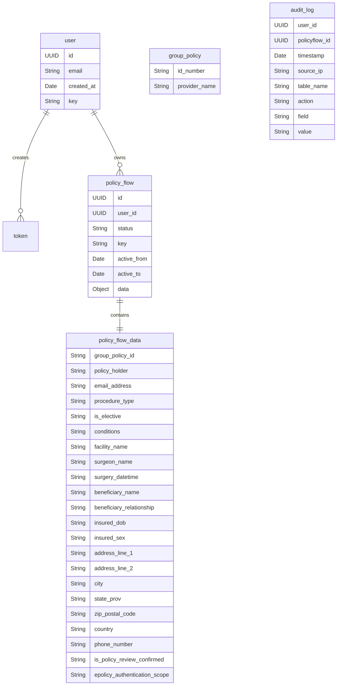

# ERD - Table Schema

```mermaid
erDiagram
    user {
        UUID id
        String email
        Date created_at
        String key
    }
    
    token {
        
    }

    group_policy {
        String id_number
        String provider_name
    }
    
    policy_flow {
        UUID id
        UUID user_id
        String status
        String key
        Date active_from
        Date active_to
        Object data
    }
    
    policy_flow_data {
        String group_policy_id
        String policy_holder
        String email_address
        String procedure_type
        String is_elective
        String conditions
        String facility_name
        String surgeon_name
        String surgery_datetime
        String beneficiary_name
        String beneficiary_relationship
        String insured_dob
        String insured_sex
        String address_line_1
        String address_line_2
        String city
        String state_prov
        String zip_postal_code
        String country
        String phone_number
        String is_policy_review_confirmed
        String epolicy_authentication_scope
    }
    
    audit_log {
        UUID user_id
        UUID policyflow_id
        Date timestamp
        String source_ip
        String table_name
        String action
        String field
        String value
    }

    user ||--o{ token : creates
    user ||--o{ policy_flow : owns
    policy_flow ||--|| policy_flow_data : contains
```
