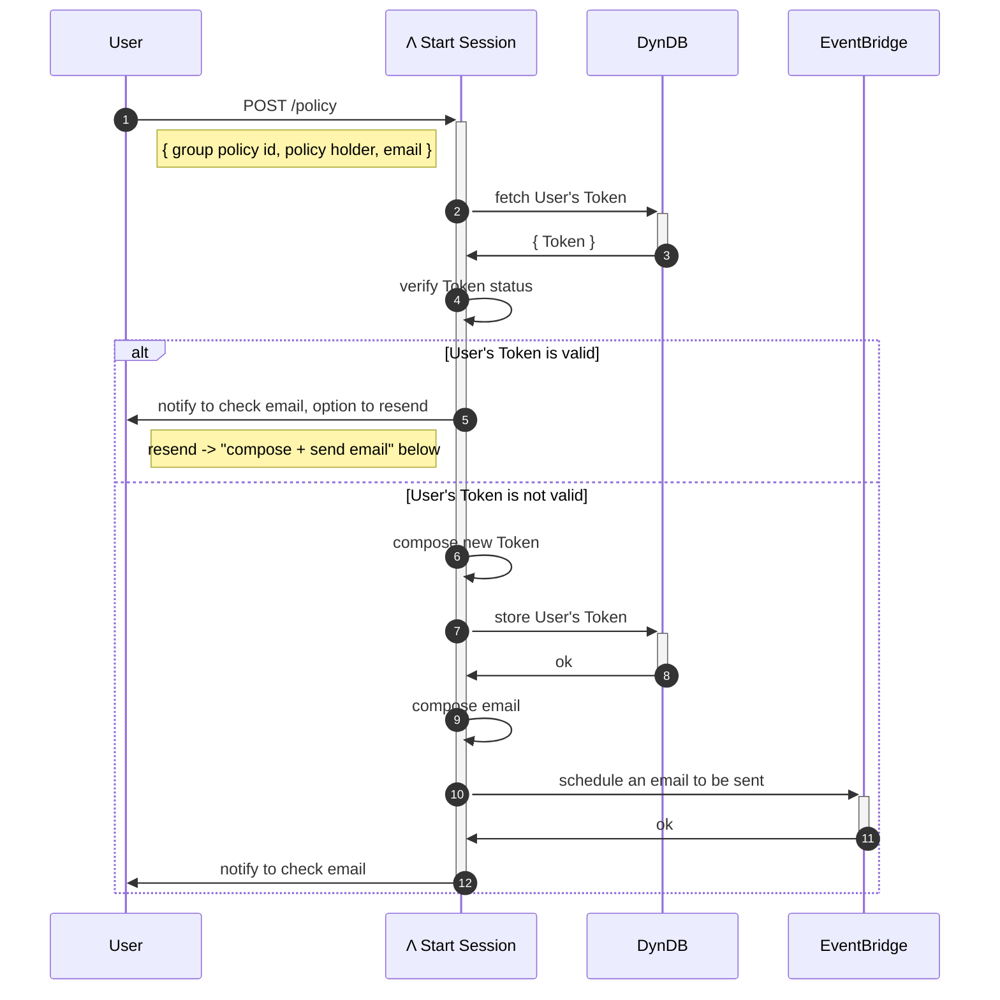

# Generate Session Token

```mermaid
sequenceDiagram
    autonumber

    User ->> +Λ Start Session: POST /policy

    Note left of Λ Start Session: { group policy id, policy holder, email }

    Λ Start Session ->> +DynDB: fetch User's Token
    DynDB ->> -Λ Start Session: { Token }
    Λ Start Session ->> Λ Start Session: verify Token status
    
    alt User's Token is valid
        Λ Start Session ->> User: notify to check email, option to resend
        Note left of Λ Start Session: resend -> "compose + send email" below
    else User's Token is not valid
        Λ Start Session ->> Λ Start Session: compose new Token
        Λ Start Session ->> +DynDB: store User's Token
        DynDB ->> -Λ Start Session: ok
        Λ Start Session ->> Λ Start Session: compose email
        Λ Start Session ->> +EventBridge: schedule an email to be sent
        EventBridge ->> -Λ Start Session: ok
        Λ Start Session ->> -User: notify to check email
    end
```
